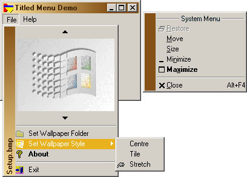

<div align="center">

## What more could you want from a Menu?


</div>

### Description

I have been working on menus since my last submission and here is the result.
 
### More Info
 
Uses Sublassing. Do not press Stop or use End.


<span>             |<span>
---                |---
**Submitted On**   |2002-06-24 21:24:52
**By**             |[Mick Doherty](https://github.com/Planet-Source-Code/PSCIndex/blob/master/ByAuthor/mick-doherty.md)
**Level**          |Intermediate
**User Rating**    |4.7 (42 globes from 9 users)
**Compatibility**  |VB 5\.0
**Category**       |[Custom Controls/ Forms/  Menus](https://github.com/Planet-Source-Code/PSCIndex/blob/master/ByCategory/custom-controls-forms-menus__1-4.md)
**World**          |[Visual Basic](https://github.com/Planet-Source-Code/PSCIndex/blob/master/ByWorld/visual-basic.md)
**Archive File**   |[What\_more\_982926242002\.zip](https://github.com/Planet-Source-Code/mick-doherty-what-more-could-you-want-from-a-menu__1-24737/archive/master.zip)

### API Declarations

```
AppendMenu		GetSystemMenu
CheckMenuRadioItem	InsertMenuItem
CreateMenu		ModifyMenu
CreatePopupMenu		SetMenu
DestroyMenu		SetMenuDefaultItem
DrawMenuBar		SetMenuItemBitmaps
GetMenuItemID		TrackPopupMenu
BitBlt			SetPixel
DrawCaption		SetTextColor
DrawText		StretchBlt
GetPixel		TransparentBlt
FillRect		OffsetRect
GetMenuItemRect		SetRect
CallWindowProc		GetDC
CopyMemory		GetSysColor
CoTaskMemFree		SetWindowLong
GetAsyncKeyState	SystemParametersInfo
GetCursorPos		WindowFromDC
RegCreateKey		RegSetValueEx
RegQyeryValueEx
SendMessage		SHGetPathFromIDList
SHBrowseForFolder
KillTimer		SetTimer
PathAppend		PathStripPath
PlaySound
```


